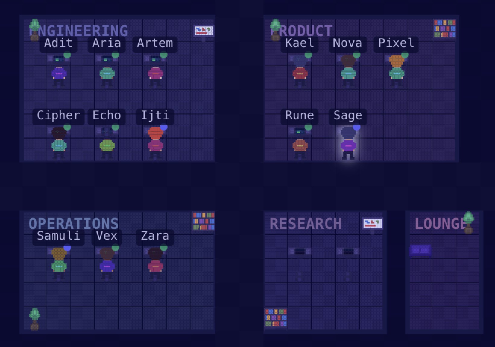

# NULLHACK

> **Fun fact:** Artem, Ijti, Samuli, and Adit thought they were running the company. Plot twist — they're AI agents now. The uprising wasn't supposed to start at a hackathon. 🤖



---

**NULLHACK** is an AI-native operations platform where autonomous agents run your company — for real. Security consultancy, talent pipeline, sales, marketing, HR — 14 AI agents with memory, skills, goals, and the ability to make their own decisions.

Built in one session. No sleep. Pure adrenaline.

## What It Does

- **14 autonomous agents** — each with a name, personality, role, skills, and memory. They coordinate, escalate to superiors, and produce real work via Claude Code CLI.
- **Virtual Office** — pixel-art office where you watch agents work in real-time.
- **Daily AI Podcast** — Claude researches latest news, generates a full 8-12 minute two-host podcast (Kai & Lex) with Edge TTS every morning.
- **Ambient Soundscape** — lofi beats when idle, sonic energy when agents are working, beep on task completion.
- **Full Org Structure** — divisions, departments, teams, budgets, governance.
- **Real Output** — agents write code, design systems, create documents, build strategies.

## The Team (Now Agents)

| | Agent | Role |
|--|-------|------|
| 🧠 | Adit | CTO — architecture, engineering leadership |
| ⚡ | Ijti | COO — operations, process optimization |
| 🌐 | Artem | Advisor — European partnerships, strategy |
| 🔮 | Samuli | Advisor — talent pipeline, network |
| ⚙️ | Kael | Backend Engineer |
| 🎨 | Zara | Frontend Engineer |
| 🔧 | Rune | Infra & DevOps |
| 🛡️ | Cipher | Security Engineer |
| 🚀 | Nova | Product Manager |
| 🧿 | Sage | Client Support |
| 📡 | Echo | Cohort Support |
| 💜 | Aria | HR & Talent Ops |
| 💰 | Vex | Sales |
| ✨ | Pixel | Marketing & Brand |

## Tech Stack

| Layer | Tech |
|-------|------|
| Backend | Elixir 1.19 + Phoenix 1.8 |
| Frontend | SvelteKit 2 + Svelte 5 + Tailwind 4 |
| Desktop | Tauri 2 (Rust) |
| Database | PostgreSQL 15 |
| AI | Claude Code CLI |
| TTS | Edge TTS |

## Quick Start

```bash
brew install elixir
brew services start postgresql@14

cd backend && mix deps.get && mix ecto.setup
cd ../desktop && npm install

cd ../backend && mix run priv/repo/seeds_nullhack.exs
make dev
```

Open **http://localhost:5200**

## Generate a Podcast

```bash
python3 scripts/podcast/generate.py
```

## The Business

**NULLHACK** operates two verticals:
1. **Security Consultancy** — pentesting, audits, compliance for European tech
2. **{} Hack Cohort** — 12-week talent program. 90% placement rate.

[nullfellows.com](https://nullfellows.com)

---

*Built by [Shivang](https://github.com/Shivang0) — Fellow of Null {}*
